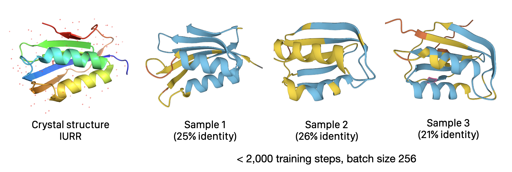
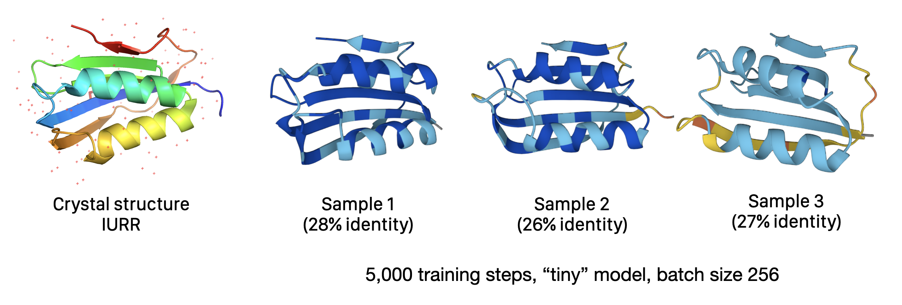

# Experiments using score entropy discrete diffusion for protein design 

- This code is a fork of and wholly based on [Aaron Lou's implementation of score entropy discrete diffusion](https://github.com/louaaron/Score-Entropy-Discrete-Diffusion), which is fully described in his research paper (which was voted ICML 2024 Best Paper), "Discrete Diffusion Modeling by Estimating the Ratios of the Data Distribution" ([https://arxiv.org/abs/2310.16834](https://arxiv.org/abs/2310.16834))
- The goal of this repository is to evaluate the usefulness of score entropy discrete diffusion for understanding protein sequences
- We hope to be able to use trained models to design new proteins with desired properties 


## Resources  

- Original implementation by Aaron Lou https://github.com/louaaron/Score-Entropy-Discrete-Diffusion 
- Original readme https://github.com/louaaron/Score-Entropy-Discrete-Diffusion 
- Paper link https://arxiv.org/abs/2310.16834


## Experiments 

For the computational setup for these experiments, I'm using a V100 node from [Lambda Labs](https://lambdalabs.com) which costs about $1.25 an hour. After launching A100 instance from Lambda, perform the following updates and installs: 

```
sudo apt-get update && sudo apt-get dist-upgrade
python -m pip install transformers datasets einops ninja packaging omegaconf hydra-core 
python -m pip install flash-attn --no-build-isolation
```

Then to run training, edit the config or provide command line options:  

```shell 
python train.py 
```

### Goals 

Changes from Aaron Lou's original implementation that are needed for modeling proteins: 

1. in `run_train.py`, we update the existing tokenizer for sampling to one that works for proteins 
2. in `data.py` we update the tokenizer used when creating datasets 
3. we need a different method of evaluating generative perplexity and other useful metrics 


### Using the existing GPT2 tokenizer

First I just wanted to try using the exact GPT2 tokenizer (with vocab size 50,257) on protein sequences, without any changes. After implementing a simple protein sequence dataset following the existing code, I was surprised to see that after only about 2,000 steps (batch size 256), the model is already producing very realistic protein sequences: 

```
>sample_1
MDTARTIHIMKGKVQGVFFRRAYTRDQARHLGITGWVRNKPDGTVELEAEGPKELLVELLAWCQQGPTARADVDDVDKVIWEPARGIKDFIIR
>sample_2
MAKQCEKIYVYGRVQGVYFRRYTYQRKAQHGITGYAKNLNDVEVLASGQDDVNIKSLMKHWLEHGPPAARVDHVEKTIEYRGRYDSFKIRY
>sample_3
MTDLNRATFLISGLVQGVCFRRASTRDEARRLGVHGWVRNLPDRRVWVLAHEEADVQRLTAWCRKGPPAAKVTEITEREAPGILEGQFLIRGSSDLDRFHVPAG
```

It's impossible to tell much just by looking at the sequence, of course, but [folding these proteins with ESMFold](https://esmatlas.com/resources?action=fold) reveals that they are predicted to fold as expected for this protein family (AcyP), despite being only about 25% sequence identical, which is an amazing result for a generative model. 




### Using an amino acid tokenizer 

I chose to implement tokenization for proteins by supplying a modified vocabulary to the existing `GPT2TokenizerFast`. I also tried creating a tokenizer class from scratch, but using the existing implementation with a modified vocabulary worked best because of the many implementation details you'd have to copy if recreating from scratch. 

The new tokenizer is initialized from files `vocab.json` and `merges.txt` that are generated when the script runs. 

```python 
from collections import OrderedDict
from transformers import GPT2TokenizerFast
import json

# Define amino acids and special tokens
amino_acids = list("ACDEFGHIKLMNPQRSTVWY")
special_tokens = ["<s>", "<pad>", "</s>", "<unk>", "<mask>"]
all_tokens = special_tokens + amino_acids

# Create the vocabulary
vocab = OrderedDict((token, idx) for idx, token in enumerate(all_tokens))

# Save the vocabulary
with open('vocab.json', 'w') as f:
    json.dump(vocab, f)

# Create an empty merges.txt file
with open('merges.txt', 'w') as f:
    f.write('#version: 0.2\n')

# Initialize the tokenizer
tokenizer = GPT2TokenizerFast(
    vocab_file='vocab.json',
    merges_file='merges.txt',
    bos_token='<s>',
    eos_token='</s>',
    unk_token='<unk>',
    pad_token='<pad>',
    mask_token='<mask>'
)
```

After training the model under several configurations on the AcyP dataset (which can be specified with "acyp" as the dataset name in the config), it seems that the SEDD model has excellent performance at modeling the data distribution for these homologous sequences, and is able to generate highly convincing sequences that fold well as predicted by ESMFold. 




### Training on UniRef50 

The next step would be to train some SEDD models of different sizes on the UniRef50 dataset and compare to the performance of autogregressive models on the same data. Some good models to compare against: ProGen, RITA, ProtT5. Some model sizes to try: 10M, 100M, 1B, 10B params. 

I adapted the existing data loading code to load the UniRef50 dataset, but haven't trained it get due to the computational cost. It takes about 4 hours to preprocess the dataset using a V100, before training begins. 

```python 
elif name == "uniref50":
        dataset = load_dataset("agemagician/uniref50", cache_dir=cache_dir)
```

Next steps: 

- [ ] Obtain funding to train the model on the UniRef50 dataset
- [ ] Train model series on the UniRef50 dataset and compare against ProGen, RITA, and ProtT5
- [ ] Publish results 