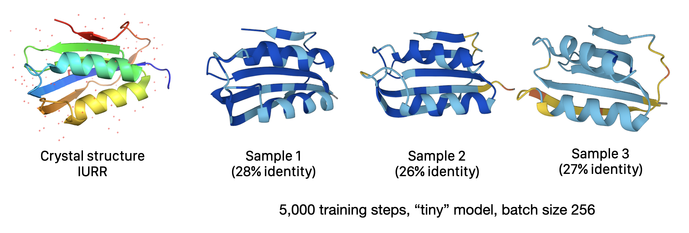

# Experiments using score entropy discrete diffusion for protein design 

This code is a fork of and wholly based on [Aaron Lou's implementation of score entropy discrete diffusion](https://github.com/louaaron/Score-Entropy-Discrete-Diffusion), which is fully described in the research paper (which was voted ICML 2024 Best Paper), "Discrete Diffusion Modeling by Estimating the Ratios of the Data Distribution" by Aaron Lou, Chenlin Meng, and Stefano Ermon ([https://arxiv.org/abs/2310.16834](https://arxiv.org/abs/2310.16834))

The goal of this repository is to evaluate the usefulness of score entropy discrete diffusion for understanding protein sequences. In particular, we hope to evaluate SEDD models trained on UniRef50 compared with existing autogregressive protein transformer models such as ProGen, RITA, and ProtT5


## Resources  

- Original implementation by Aaron Lou https://github.com/louaaron/Score-Entropy-Discrete-Diffusion 
- Original readme https://github.com/louaaron/Score-Entropy-Discrete-Diffusion 
- "Discrete Diffusion Modeling by Estimating the Ratios of the Data Distribution" by Aaron Lou, Chenlin Meng, and Stefano Ermon https://arxiv.org/abs/2310.16834


## Experiments 

For the computational setup for these experiments, I'm using a A100 instance from [Lambda Labs](https://lambdalabs.com) which costs about $1.25 an hour. After launching A100 instance from Lambda, I perform the following updates and installs to update the Torch and CUDA installs to the latest versions, then:

```
sudo apt-get update && sudo apt-get dist-upgrade
python -m pip install transformers datasets einops ninja packaging omegaconf hydra-core 
python -m pip install flash-attn --no-build-isolation
```

Then to run training, edit the config or provide command line options:  

```shell 
python train.py 
```

Changes from Aaron Lou's original implementation that are needed for modeling protein sequence data are not significant: 

1. In the training script `run_train.py` and the data loading implementation in `data.py`, we update the existing tokenizer for sampling to one that uses the amino acid vocabulary (plus special tokens)

However, in order for us to evaluate these models, we'll need to think more carefully about downstream use cases. 

1. In the training script we update the evaluations to be protein-specific (comparing against a protein model in generation perplexity and evaluating mutational effect scores using an experimental dataset)

### Adapting the implementation for protein data 

#### Using the existing GPT2 tokenizer

First I just wanted to try using the exact GPT2 tokenizer (with vocab size 50,257) on protein sequences, without any changes. After implementing a simple protein sequence dataset following the existing code, I was surprised to see that after only about 2,000 steps (batch size 256), the model is already producing very realistic protein sequences: 

```
>sample_1
MDTARTIHIMKGKVQGVFFRRAYTRDQARHLGITGWVRNKPDGTVELEAEGPKELLVELLAWCQQGPTARADVDDVDKVIWEPARGIKDFIIR
>sample_2
MAKQCEKIYVYGRVQGVYFRRYTYQRKAQHGITGYAKNLNDVEVLASGQDDVNIKSLMKHWLEHGPPAARVDHVEKTIEYRGRYDSFKIRY
>sample_3
MTDLNRATFLISGLVQGVCFRRASTRDEARRLGVHGWVRNLPDRRVWVLAHEEADVQRLTAWCRKGPPAAKVTEITEREAPGILEGQFLIRGSSDLDRFHVPAG
```

It's impossible to tell much just by looking at the sequence, of course, but [folding these proteins with ESMFold](https://esmatlas.com/resources?action=fold) reveals that they are predicted to fold as expected for this protein family (AcyP), despite being only about 25% sequence identical, which is an amazing result for a generative model. 


#### Using an amino acid tokenizer 

I chose to implement tokenization for proteins by supplying a modified vocabulary to the existing `GPT2TokenizerFast`. I also tried creating a tokenizer class from scratch, but using the existing implementation with a modified vocabulary worked best because of the many implementation details you'd have to copy if recreating from scratch. 

The new tokenizer is initialized from files `vocab.json` and `merges.txt` that are generated when the script runs. 

```python 
from collections import OrderedDict
from transformers import GPT2TokenizerFast
import json

# Define amino acids and special tokens
amino_acids = list("ACDEFGHIKLMNPQRSTVWY")
special_tokens = ["<s>", "<pad>", "</s>", "<unk>", "<mask>"]
all_tokens = special_tokens + amino_acids

# Create the vocabulary
vocab = OrderedDict((token, idx) for idx, token in enumerate(all_tokens))

# Save the vocabulary
with open('vocab.json', 'w') as f:
    json.dump(vocab, f)

# Create an empty merges.txt file
with open('merges.txt', 'w') as f:
    f.write('#version: 0.2\n')

# Initialize the tokenizer
tokenizer = GPT2TokenizerFast(
    vocab_file='vocab.json',
    merges_file='merges.txt',
    bos_token='<s>',
    eos_token='</s>',
    unk_token='<unk>',
    pad_token='<pad>',
    mask_token='<mask>'
)
```

After training the model under several configurations on the AcyP dataset (which can be specified with "acyp" as the dataset name in the config), it seems that the SEDD model has excellent performance at modeling the data distribution for these homologous sequences, and is able to generate highly convincing sequences that fold well as predicted by ESMFold. 




### Training on UniRef50 

The next step would be to train some SEDD models of different sizes on the UniRef50 dataset and compare to the performance of autogregressive models on the same data. Some good models to compare against: ProGen, RITA, ProtT5. Some model sizes to try: 10M, 100M, 1B, 10B params. 

I adapted the existing data loading code to load the UniRef50 dataset, but haven't trained it fully yet, due to the computational cost. From my experiments, it takes about 4 hours to preprocess the dataset using an A100, before training begins. Once training begins, for the tiny model on short sequences of length 128, we get about 1,000 steps of batch size 128 per minute on the A100, which is about 15 million tokens per minute. UniRef50 contains around 40 million sequences with an average length of 256, for a total of 10 billion tokens. I approximate this will take over 10 hours to train on the A100 (for the tiny model). 

I've provided the code to load UniRef50 in this repo:

```python 
elif name == "uniref50":
    dataset = load_dataset("agemagician/uniref50", cache_dir=cache_dir)
```

You can train on UniRef50 by providing the dataset name "uniref50" in the Hydra config. 

Next steps (2024-10-7): 

- [ ] Obtain funding to train the model on the UniRef50 dataset
- [ ] Train model param grid (model size and layers) on the UniRef50 dataset and compare against ProGen, RITA, and ProtT5 on evaluation metrics  


### Protein design evals for score entropy discrete diffusion models 

The primary evaluations done in the protein sequence modeling literature fall into three broad categories. I'm going to leave out the use of sequence-based embeddings to predict structures, as is done in AlphaFold and ESMFold, and focus on direct uses of protein language models. 

1. Using model representation (embeddings) for a downstream task (for example: predicting which class a protein belongs in, or predicting the per-token secondary structure)
2. Predicting the likelihood of sequences or mutants of sequences (for example, eliminating low-confidence proteins from a metagenomic search, or removing evolutionary-unlikely mutations from design space)
3. Sampling from the model to generate new sequences (potentially conditionally)

I think the trick will be, can we design evals that are feasible for both autogregressive models and SEDD models, so that we can directly compare performance? We already know that we can effectively train on the same datasets. 

There are of course some unique evaluations that would be very interesting for SEDD models. First, I'd like to see how well the concrete score predicts mutations for sequences "one token away" and recapitulates phylogenetic distances. It's also very interesting to think about prompting the SEDD model: since we can do arbitrary discontinuous prompts, we have a good mechanism for performing "fill in blank" design, we can also be achieved via masking in autogregressive models. 

I'd propose the following evals for SEDD models for protein design, in addition to the classics like secondary structure prediction. 

**Mutation effect prediction.** Calculate the score of mutated sequences under the model using the concrete score and assess correlation with experimentally-observed mutation effects. Carefully select benchmark data that measures sequence fitness in a natural context—protein engineering or design benchmarks [will not have signal](https://alexcarlin.bearblog.dev/the-problem-with-proteingym).

**Metagenomic distance.** Can the model tell the difference between two functional homologs, and "decoy" sets of proteins that are evolutionarily related but perform different functions? On samples of metagenomic space experimentally tested for a particular function, does the model assign higher scores to proteins with better intrinsic properties such as stability or $k_{cat}$? Can the model separately model taxonomy and functional properties? 

**Relative functional importance.** Broadly, does the model learn which parts of proteins are fungible and which are necessary? Does the model correctly ignore small changes to irrelevant amino acids while strongly disfavoring non-functional sequences? As a first pass at this, collected labeled active site residues from UniProt and assess scores at those positions. 
